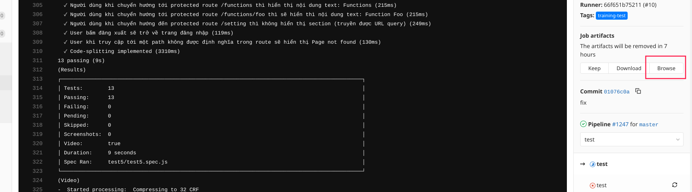
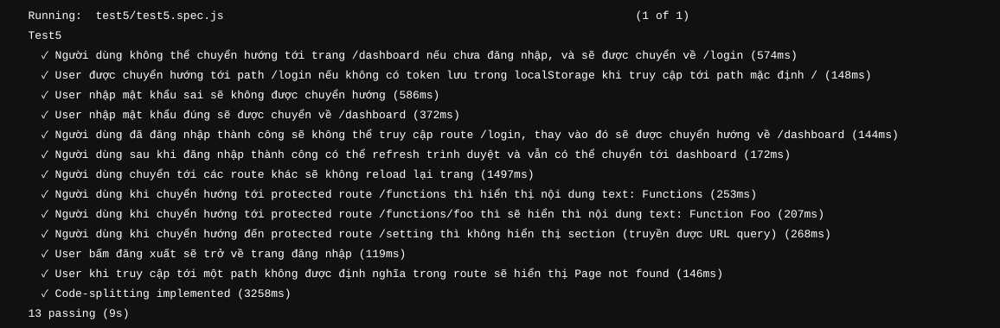

## Mục tiêu của bài test

1. Sử dụng được react-router-dom để navigate các trang với nhau
2. Kết hợp được react-router-dom và phương thức xác thực người dùng thông qua trang đăng nhập
3. React code-splitting kết hợp với react-router-dom
4. Dynamic route config
5. Truyền tham số trên url

## Lưu ý

1. Khi người dùng đăng nhập thành công, sẽ lưu giá trị của token (tùy ý với độ dài lớn hơn 0) tại localStorage với tên là _token_.
2. Sử dụng file config route và component (vì trong thực tế không thể config bằng tay)
3. Nếu chạy test bị lỗi có thể xem lại video test bằng cách click vào phím phía dưới
      

     
   

4. Tham khảo trang bài giải mẫu tại [đây](http://test5.training.phuonghau.com)

## Test case

1. Người dùng truy cập đến _/dashboard_. Vì chưa đăng nhập, nên người dùng được chuyển về path _/login_
2. Nếu người dùng không có token thì người dùng sẽ được chuyển đến route đăng nhập _/login_
3. Khi người dùng đang ở trang đăng nhập /login và nhập mật khẩu **sai** vào input (với selector là _input[data-test=login__pwd]_) và nút submit (với selector là _button[data-test=login__submit]_) thì sẽ không được chuyển hướng tới _/dashboard_, đồng thời input nhập mật khẩu cũng sẽ được reset về giá trị rỗng.
4. Ngược lại, user nhập mật khẩu đúng sẽ được chuyển về /dashboard, tương tự với selector ở case 3, khi người dùng nhập mật khẩu là **123** thì người dùng sẽ được chuyển hướng về /dashboard.
5. Người dùng đã đăng nhập thành công sẽ không thể truy cập route /login, thay vào đó sẽ được chuyển hướng về /dashboard.
6. Người dùng sau khi đăng nhập thành công có thể refresh trình duyệt và khi truy cập tới route mặc định _/_ và tự động được chuyển tới _/dashboard_
7. Người dùng chuyển tới các route qua lại sẽ không reload lại trang (chỉ render component khác chứ không sử dụng location api của window object) (là 1 thuộc tính của SPA)
8. Người dùng khi chuyển hướng tới protected route /functions thì hiển thị nội dung text: Functions page
9. Người dùng khi chuyển hướng tới protected route /functions/foo thì sẽ hiển thì nội dung text: Function Foo
10. Người dùng khi chuyển hướng đến protected route /setting thì không hiển thị section (truyền được URL query). Ví dụ _/setting?section=general_ thì sẽ hiển thị nội dung: _Setting page - Section: general_
11. User bấm đăng xuất với selector _button[data-test=logout__btn]_ sẽ trở về trang đăng nhập.
12. User khi truy cập tới một route không được định nghĩa trong file config sẽ hiển thị _Page not found_ với selector _[data-test=404]_
13. Ứng dụng được implement code-splitting

### Success Example

  

     
   

